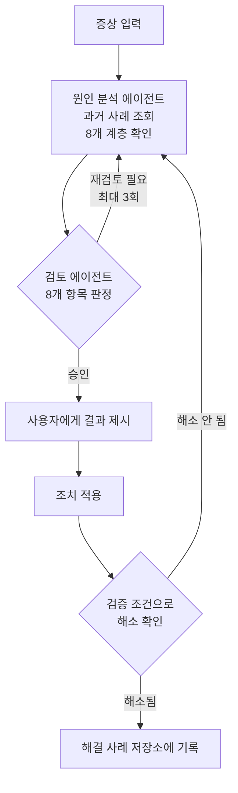

## 참고자료

- [Google SRE Book - Effective Troubleshooting](https://sre.google/sre-book/effective-troubleshooting/)
- [Richard Cook - How Complex Systems Fail](https://how.complexsystems.fail/)
- [Brendan Gregg - Performance Analysis Methodology](https://www.brendangregg.com/methodology.html)
- [Claude Code Docs - Subagents](https://code.claude.com/docs/en/sub-agents)
- [Claude Code Docs - Hooks](https://code.claude.com/docs/en/hooks)

---

## 배경

Claude Code로 장애 원인을 분석할 때 반복되는 문제가 있었다. 모델이 공식 문서의 기본값을 우리 환경의 설정값인 것처럼 적거나, 같은 시각에 발생한 로그 두 개를 원인과 결과로 연결하거나, 확인하지 않은 항목에 "확인됨"을 붙였다. 같은 대화 안에서 "다시 검토해 봐"라고 요청해도 앞서 내린 결론을 유지하는 방향으로 근거를 보강하는 경우가 많았다.

2026년 9월 초에 원인 분석과 검토를 별도 서브에이전트(별도 컨텍스트에서 일을 맡는 보조 에이전트)로 나누고, 해결이 확인된 사례만 기록하는 저장소를 붙였다. 계층별 진단 에이전트(도구를 골라 쓰며 스스로 다음 행동을 정하는 반복 구조)를 병렬로 실행하는 구성은 [인프라 운영 AI 에이전트 구축](/posts/ai-agent-for-infra-operations/) 글의 6.4절에 정리했고, 이 글은 그 결과를 검토하는 단계를 다룬다.

정리하면서 확인하고 싶었던 것들이다.

- 같은 모델에게 자기 진단을 검토시키면 왜 잘 안 되는가?
- 검토 에이전트는 무엇을 기준으로 진단을 판정하는가?
- 과거 해결 사례는 어떤 조건에서 기록하고, 어떻게 참고하는가?
- 실제 저장소에 적용했을 때 무엇이 발견됐는가?

---

## 큰 그림



원인 분석 에이전트가 진단과 해결책, 검증 조건을 만들고, 검토 에이전트가 이를 판정한다. 승인된 진단만 사용자에게 전달하고, 조치 후 검증 조건으로 해소가 확인된 경우에만 사례를 기록한다.

1절은 검토를 분리한 이유, 2절은 원인 분석 에이전트의 진단 범위, 3절은 검토 항목, 4절은 해결 사례 저장소, 5절은 실행 방식, 6절은 실제 저장소에 적용한 결과다.

---

## 1. 검토를 별도 에이전트로 분리한 이유

같은 대화 안에서 자기 진단을 검토시키면, 모델은 앞서 자신이 찾은 근거와 추론 과정을 모두 컨텍스트에 갖고 있는 상태에서 검토한다. 이미 채택한 가설을 기준으로 나머지 정보를 해석하게 되어 확증 편향(처음 세운 가설에 맞는 근거만 찾고 반대 근거는 가볍게 넘기는 경향)이 남는다.

서브에이전트는 메인 대화와 분리된 컨텍스트에서 실행된다. 검토 에이전트에는 진단 결과 문서만 전달하고, 진단을 만드는 과정의 대화는 전달하지 않는다. 검토 에이전트 입장에서는 처음 보는 진단서를 받아 근거가 충분한지 판단하는 상황이 된다. 코드 리뷰에서 작성자가 아닌 사람이 리뷰하는 것과 같은 구조다.

검토 에이전트에는 대안 진단을 제시하지 못하게 했다. 검토 에이전트가 자기 가설을 내기 시작하면 두 에이전트가 각자의 결론을 주장하는 구조가 되고, 검토라는 역할이 흐려진다. 검토 에이전트는 "이 가능성을 배제한 근거가 없다"까지만 지적하고, 재조사는 원인 분석 에이전트가 한다.

---

## 2. 원인 분석 에이전트의 진단 범위

원인 분석 에이전트는 진단 전에 해결 사례 저장소의 색인을 검색해 비슷한 증상이 있었는지 확인한다. 그다음 8개 계층을 차례로 확인한다.

| 계층 | 확인 대상 예 |
|---|---|
| 엣지 | 로드밸런서, DNS, 인증서 |
| 게이트웨이 | API 게이트웨이 라우팅, 타임아웃, 재시도 설정 |
| 메시, 네트워크 | 서비스 메시, CNI, 네트워크 정책 |
| 오케스트레이션 | Pod 상태, 재시작 횟수, 노드 자원 |
| 애플리케이션 런타임 | JVM 힙, GC, 스레드 풀, 커넥션 풀 |
| 데이터 | DB, 캐시, 메시지 큐 |
| 외부 의존성 | 외부 API, 인증 서버 |
| 최근 변경 | 배포 이력, 설정 변경 커밋 |

계층을 고정한 이유는 가로등 효과(streetlight effect)를 줄이기 위해서다. 가로등 효과는 원인이 있을 만한 곳 대신 확인하기 쉬운 곳만 살펴보는 경향을 말한다. Brendan Gregg는 성능 분석에서 이를 피해야 할 방법론으로 분류했다. 계층을 고정해 두면 확인하지 않은 계층이 결과에 드러난다.

진단 결과에는 다음 항목을 반드시 포함하게 했다.

- 각 가설과 그 근거. 근거에는 실행한 명령의 출력, 로그 발췌, 설정 파일 경로 중 하나를 붙인다.
- 채택하지 않은 가설과 배제한 근거.
- 해결책이 원인을 어떻게 제거하는지에 대한 설명.
- 조치 후 해소를 판단할 검증 조건.

버전이나 설정값은 공식 문서의 기본값을 인용하지 않고, 버전 확인 명령이나 선언형 설정 파일, 소스 코드에서 직접 확인하도록 했다. 이 구성을 만드는 과정에서도 공식 문서의 기본값을 우리 환경의 설정처럼 적은 사례가 여러 건 나왔기 때문이다.

---

## 3. 검토 항목

검토 에이전트는 8개 항목을 각각 "통과" 또는 "의심"으로 판정하고, 전체 결과를 "승인" 또는 "재검토 필요" 중 하나로 낸다.

| 항목 | 확인 내용 |
|---|---|
| 상관관계와 인과관계 | 같은 시각에 발생했다는 것만으로 원인을 정하지 않았는지, 선후 관계를 타임스탬프로 확인했는지 |
| 계층 누락 | 8개 계층 중 근거 없이 "이상 없음"으로 넘어간 계층이 있는지 |
| "확인됨" 표기 | "확인됨"으로 적힌 항목마다 명령 출력, 로그, 문서 링크가 붙어 있는지. 없으면 "추측"으로 바꾸도록 요구 |
| 대안 가설 | 채택하지 않은 가설을 데이터로 배제했는지, "가능성이 낮아 보여서" 배제했는지 |
| 해결책의 인과 관계 | 원인, 조치, 해소로 이어지는 설명에 빠진 단계가 있는지. 재시작이나 스케일 아웃 같은 임시 조치를 근본 해결로 적지 않았는지 |
| 검증 조건 | "에러가 안 보이면 해결"처럼 재발 여부를 판단할 수 없는 기준인지 |
| 일반론과 실측 | 공식 문서 기본값을 이 환경의 설정처럼 적은 곳이 있는지 |
| 과거 사례 의존 | 과거 사례를 근거로 쓴 부분을 이번에 다시 확인했는지 |

상관관계와 인과관계 항목은 Google SRE Book의 트러블슈팅 장에서, 다중 원인 관점은 Richard Cook의 "How Complex Systems Fail"에서 가져왔다. 복잡한 시스템의 장애는 보통 하나의 원인이 아니라 여러 조건이 겹쳐서 발생하므로, 원인 하나만 남기고 나머지를 버리면 재발 조건을 놓친다.

"재검토 필요" 판정이 나오면 검토 에이전트의 지적 사항을 원인 분석 에이전트에 전달해 다시 조사한다. 반복은 최대 3회로 제한했다. 3회 안에 승인되지 않으면 그 상태와 남은 지적 사항을 그대로 사용자에게 보여 준다.

---

## 4. 해결 사례 저장소

해결한 장애를 기록해 두면 다음 진단에서 비슷한 증상이 나왔을 때 먼저 참고할 수 있다. 다만 확인되지 않은 추정을 기록하면 다음 진단에서 잘못된 선입견으로 작용한다.

그래서 기록 조건을 두 가지로 제한했다.

- 조치를 적용하고, 진단 단계에서 정한 검증 조건으로 해소를 확인한 경우에만 기록한다.
- 기록할 때는 증상, 원인, 조치, 검증 결과를 함께 적고, 색인 파일에 한 줄 요약을 추가한다.

참고할 때도 제한을 두었다. 원인 분석 에이전트는 과거 사례를 후보 가설로만 사용하고, 이번 장애에서 다시 실측으로 확인해야 한다. 검토 항목의 "과거 사례 의존"이 이 부분을 점검한다.

---

## 5. 실행 방식

기본 실행 방식은 스킬(작업 절차를 묶은 Claude Code 폴더)이다. 스킬에 증상 정리, 원인 분석 에이전트 호출, 검토 에이전트 호출, 결과 제시, 조치 후 검증, 사례 기록 순서를 적어 두었다.

스킬은 모델이 작업 내용과 스킬 설명을 비교해 스스로 불러오는데, 짧은 에러 문의에서는 불러오지 않는 경우가 있었다. 그래서 `UserPromptSubmit` 훅(Hook, 정해진 시점에 자동 실행되는 셸 명령)을 추가했다. `UserPromptSubmit`은 사용자가 프롬프트를 제출할 때 실행되는 훅이고, 훅이 JSON의 `additionalContext` 필드로 출력한 문구는 모델의 컨텍스트에 추가된다. 훅 스크립트는 프롬프트에 에러, 장애, 타임아웃, 5xx 상태 코드 같은 키워드가 있으면 이 스킬을 사용하라는 안내 문구를 출력한다.

```json
"UserPromptSubmit": [
  {
    "hooks": [
      { "type": "command", "command": "bash ~/.claude/hooks/rca-trigger.sh" }
    ]
  }
]
```

8개 계층을 하나씩 확인하면 시간이 오래 걸리므로, 계층별 확인을 서브에이전트 8개로 동시에 실행하는 스크립트 버전도 만들었다. 각 계층 확인은 서로 독립적이라 병렬로 실행해도 결과가 달라지지 않는다. 결과를 모은 뒤 진단 종합과 검토 반복은 순차 버전과 같다. 이 버전은 진단까지만 수행하고, 조치 후 검증과 사례 기록은 대화에서 별도로 진행한다.

---

## 6. 실제 저장소 적용 결과

2026년 9월 3일에 병렬 버전을 인프라 설정 저장소에 대해 실행했다.

첫 실행은 검토 반복 3회차에서 계정 사용량 한도에 걸려 검토 에이전트 호출이 실패했다. 스크립트가 호출 결과가 비어 있는 경우를 처리하지 않아 오류로 종료됐다. 호출 결과가 비어 있으면 반복을 중단하고 중단 사유를 결과에 남기도록 수정한 뒤, 완료된 단계의 결과를 재사용해 3회차부터 다시 실행했고 최종 판정은 승인이었다.

이 실행 과정에서 원인 분석 절차의 오류 2건이 드러났다.

| 오류 | 내용 | 반영 |
|---|---|---|
| 파일 이력 누락 | 게이트웨이 설정 파일의 Git 이력을 조회할 때 `--follow`를 쓰지 않아, 파일 이름이 바뀌기 전의 커밋이 조회되지 않음 | 하위 저장소를 조사할 때 `git rev-parse --show-toplevel`로 저장소 루트를 먼저 확인하고 `git log --follow`를 기본으로 사용하도록 에이전트 지침에 추가 |
| 커밋 귀속 오류 | CNI 버전 변경과 관련된 커밋 해시를 확인 없이 인용해 다른 변경과 연결함 | 다음 반복에서 `git merge-base --is-ancestor`로 해당 커밋이 실제로 포함됐는지 확인해 정정 |

같은 실행에서 8월 말에 개발 클러스터에서 발생했던 DNS 장애(CNI 버전이 설정 파일 일부에만 갱신된 상태로 노드를 재부팅한 뒤, DNS 요청의 절반가량이 정책 단계에서 차단된 건)의 원인과 조치 내역을 커밋 메시지에서 찾았고, 해결이 확인된 사례였으므로 저장소의 첫 기록으로 남겼다.

---

## 정리하며

처음 던진 질문들에 대한 답이다.

- **같은 모델에게 자기 진단을 검토시키면 왜 잘 안 되는가?** 진단 과정의 추론이 컨텍스트에 남아 있어 채택한 가설을 기준으로 검토하게 된다. 진단 결과만 별도 컨텍스트의 서브에이전트에 전달하면 이 영향을 줄일 수 있다.
- **검토 에이전트는 무엇을 기준으로 판정하는가?** 상관관계와 인과관계, 계층 누락, "확인됨" 표기 근거, 대안 가설 배제, 해결책의 인과 관계, 검증 조건, 일반론과 실측 구분, 과거 사례 의존의 8개 항목이다. 대안 진단은 내지 않는다.
- **과거 사례는 어떻게 기록하고 참고하는가?** 검증 조건으로 해소가 확인된 경우에만 기록하고, 참고할 때는 후보 가설로만 쓴 뒤 다시 실측한다.
- **실제 저장소에 적용했을 때 무엇이 발견됐는가?** Git 이력 조회 누락과 커밋 귀속 오류 2건이 드러나 에이전트 지침에 반영했다.

검토 에이전트를 둔다고 진단이 정확해지는 것은 아니지만, 근거 없이 "확인됨"으로 적힌 항목은 사용자에게 전달되기 전에 걸러진다.
