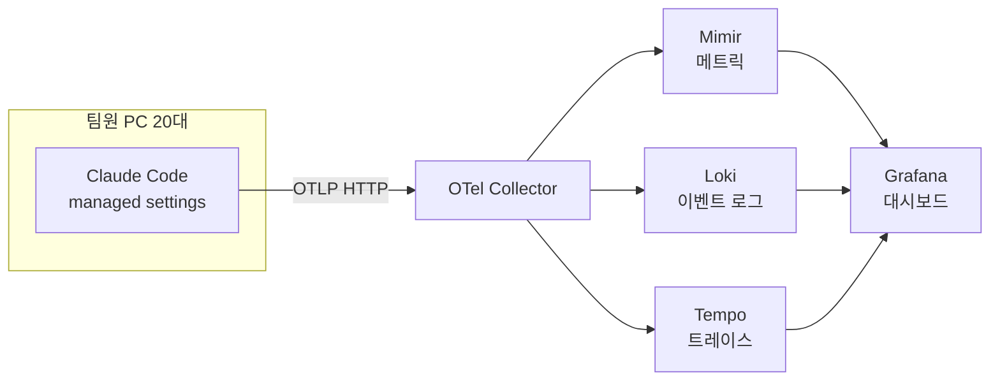
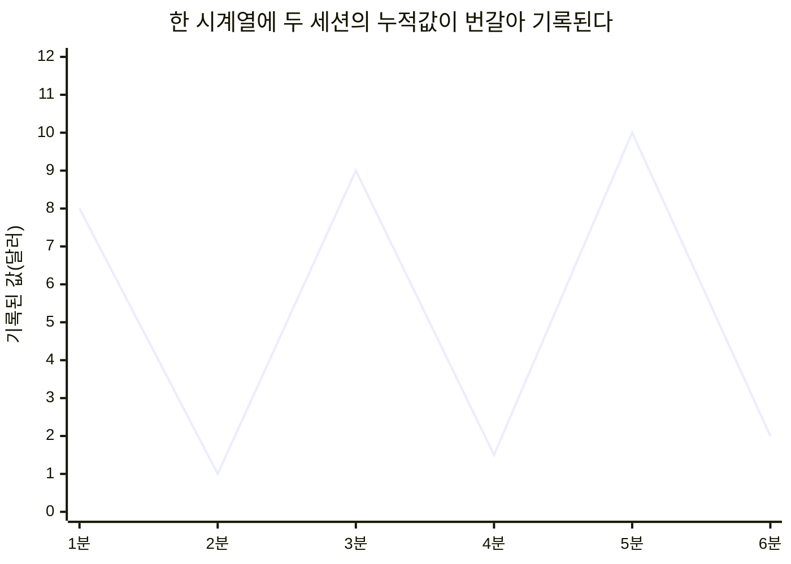

## 참고자료

- [Claude Code Docs - Monitoring usage](https://code.claude.com/docs/en/monitoring-usage)
- [Claude Code Docs - Settings](https://code.claude.com/docs/en/settings)
- [OpenTelemetry - Metrics Data Model](https://opentelemetry.io/docs/specs/otel/metrics/data-model/)
- [Prometheus - Query functions](https://prometheus.io/docs/prometheus/latest/querying/functions/)
- [Grafana Loki - Metric queries](https://grafana.com/docs/loki/latest/query/metric_queries/)
- [OpenTelemetry Collector - filter processor](https://github.com/open-telemetry/opentelemetry-collector-contrib/tree/main/processor/filterprocessor)
- [OpenTelemetry Collector - tail sampling processor](https://github.com/open-telemetry/opentelemetry-collector-contrib/tree/main/processor/tailsamplingprocessor)

---

## 배경

6월 말, 팀에서 Claude Code를 쓰는 사람이 갑자기 늘었다. 누가 얼마나 쓰는지, 비용이 어느 정도인지, 어떤 도구와 스킬이 실제로 불리는지 아무도 몰랐다. 각자의 PC 안에만 있는 정보였다.

마침 그때 관측성(Observability, 외부 데이터로 내부 상태를 알아내는 정도) 스택을 LGTM(Loki, Grafana, Tempo, Mimir. 각각 로그, 대시보드, 트레이스, 메트릭 저장소)으로 새로 세우던 중이었다. Claude Code는 OpenTelemetry(트레이스, 메트릭, 로그 수집 표준)로 사용량을 내보내는 기능이 있다. 이미 있는 수집기로 받으면 인프라를 늘리지 않고 붙일 수 있었다.

6월 26일에 수집을 시작했고, 7월 중순까지 트레이스와 접근 제어를 추가했다. 9월 9일에 수집을 중단하고 관련 설정과 대시보드를 삭제했다. 이 글은 구축부터 중단까지의 기록이다.

정리하면서 확인하고 싶었던 것들이다.

- 팀원 PC 스무 대의 설정을 어떻게 한 번에 강제하는가?
- 대시보드에 비용이 22만 달러로 찍혔는데 실제로는 2천 7백 달러였다. 왜 115배가 됐는가?
- 프롬프트 본문까지 모으면 누가 볼 수 있어야 하는가?
- 보내는 쪽이 스무 대인데, 수집을 끊으려면 어디를 고쳐야 하는가?

---

## 큰 그림

데이터 수집 경로는 다음과 같다.



1절은 PC별 설정 배포, 2절은 설정 두 항목 때문에 발생한 비용 지표 과다 집계, 3절은 프롬프트 본문 접근 제어, 4절은 수집기에서 처리한 수집 중단 작업이다.

---

## 1. managed settings로 설정 배포

Claude Code의 설정 파일에는 여러 단계가 있다. 그중 관리형 설정(managed settings)은 가장 위에 있어서 사용자가 자기 설정으로 덮어쓸 수 없다. 조직이 강제하려는 설정을 여기 둔다. 위치는 OS마다 정해져 있다.

| OS | 위치 |
|---|---|
| macOS | `/Library/Application Support/ClaudeCode/managed-settings.json` |
| Linux, WSL | `/etc/claude-code/managed-settings.json` |
| Windows | `C:\Program Files\ClaudeCode\managed-settings.json` |

넣은 설정은 이랬다.

```json
{
  "env": {
    "CLAUDE_CODE_ENABLE_TELEMETRY": "1",
    "OTEL_METRICS_EXPORTER": "otlp",
    "OTEL_LOGS_EXPORTER": "otlp",
    "OTEL_TRACES_EXPORTER": "otlp",
    "OTEL_EXPORTER_OTLP_PROTOCOL": "http/protobuf",
    "OTEL_EXPORTER_OTLP_ENDPOINT": "http://<수집기 주소>:4318",
    "OTEL_EXPORTER_OTLP_METRICS_TEMPORALITY_PREFERENCE": "cumulative",
    "OTEL_METRIC_EXPORT_INTERVAL": "60000",
    "OTEL_METRICS_INCLUDE_SESSION_ID": "false",
    "OTEL_METRICS_INCLUDE_ACCOUNT_UUID": "false",
    "OTEL_LOG_USER_PROMPTS": "1",
    "OTEL_LOG_TOOL_DETAILS": "1",
    "OTEL_RESOURCE_ATTRIBUTES": "service.name=claude-code"
  }
}
```

OTLP는 OpenTelemetry의 전송 규격이다. 메트릭, 로그, 트레이스 세 종류(시그널)를 같은 형식으로 수집기에 보낸다. 여기서 메트릭은 토큰 수와 비용 같은 숫자 집계, 로그는 요청 하나하나의 이벤트, 트레이스는 한 번의 상호작용 안에서 일어난 단계들의 시간 기록이다.

설치는 OS별 스크립트로 했다. 그런데 Windows에서 데이터가 하나도 안 들어왔다. 처음 스크립트가 파일을 `C:\ProgramData\ClaudeCode\`에 두고 있었는데, 실제로 읽는 위치는 `C:\Program Files\ClaudeCode\`였다. 파일은 있는데 읽히지 않으니 오류도 안 났다. `claude -p "ok" --debug-file dbg.log`로 디버그 로그를 남겨 보니 `isTelemetryEnabled`가 꺼져 있었다. 스크립트를 수정하고, 이미 설치한 팀원에게 재실행을 안내했다. 관리형 설정은 적용 여부가 화면에 표시되지 않으므로 확인 명령을 설치 안내 문서에 처음부터 포함해야 했다.

그리고 무엇을 모으는지는 설치하는 사람에게 먼저 밝혔다. 입력 프롬프트 본문, 토큰과 비용, 호출한 도구와 그 인자, 실행한 셸 명령과 파일 경로를 모으고, 모델의 응답 본문은 모으지 않는다고 적었다. 관리형 설정이라 Claude Code 안에서는 끌 수 없고, 끄려면 제거 스크립트를 실행해야 한다는 것도 적었다.

---

## 2. 비용 지표 115배 과다 집계 원인

대시보드 운영 2주차에 팀 누적 비용이 22만 5천 달러로 표시됐다. 실제 청구 규모와 맞지 않는 값이었다. 요청 이벤트 로그의 비용을 직접 합산하니 2,690달러였고, 표시 값은 실제의 약 115배였다.

원인은 1절 설정 중 두 항목의 조합이었다.

### 2.1 카운터 전송 방식(temporality)

`claude_code.cost.usage` 같은 메트릭은 카운터(counter)다. 계속 올라가기만 하는 값이다. 이 값을 보내는 방식(temporality)이 두 가지다.

| 방식 | 보내는 값 | 예 |
|---|---|---|
| delta | 지난번 보낸 뒤로 늘어난 만큼 | 이번 1분에 0.3달러 |
| cumulative | 시작부터 지금까지 쌓인 전체 | 지금까지 4.7달러 |

Claude Code의 기본값은 delta다. 그런데 Mimir 같은 Prometheus 계열 저장소는 cumulative를 기준으로 계산한다. 그래서 `cumulative`로 바꿨다. 여기까지는 맞는 선택이었다.

### 2.2 세션 라벨 제거로 인한 시계열 혼합

메트릭 저장소에서 라벨 조합 하나가 시계열(time series) 하나다. 라벨 값이 다양할수록 시계열이 많아지고, 이걸 카디널리티(cardinality)라고 부른다. 카디널리티가 너무 높으면 저장소가 느려지고 비싸진다. 세션 ID는 Claude Code를 켤 때마다 새로 생기는 값이라 시계열을 끝없이 늘린다. 그래서 `OTEL_METRICS_INCLUDE_SESSION_ID`를 `false`로 껐다. 기본값은 켜짐이다.

두 설정을 함께 쓰면 다음 문제가 생긴다. 같은 사람이 터미널 두 개에서 세션 A와 B를 동시에 쓴다. 두 세션은 각자 0부터 시작하는 누적값을 보낸다. 세션 라벨이 없으니 저장소에서는 둘이 **같은 시계열**이다.



세션 A는 8, 9, 10달러로 천천히 오르고, 막 켠 세션 B는 1, 1.5, 2달러다. 한 줄에 번갈아 기록되니 값이 오르내린다.

대시보드는 이 값에 `increase()`나 `rate()`를 썼다. 이 함수들은 카운터가 줄어들면 "프로세스가 재시작돼서 0부터 다시 셌다"고 본다. 이걸 카운터 리셋(counter reset)이라고 한다. 리셋이 일어났다고 판단하면 줄어든 뒤의 값을 통째로 새로 늘어난 양으로 더한다. 8에서 1로 내려가면 리셋이고, 그다음 9는 "리셋 뒤 0에서 9까지 늘어났다"가 된다. 실제로 A는 1달러, B는 0.5달러 늘었을 뿐인데 9달러로 계산된다. 세션이 엇갈릴 때마다 이게 반복되면서 115배가 됐다.

### 2.3 수정: 요청 이벤트 기반 집계로 변경

세션 라벨을 다시 켜면 카디널리티 문제가 생기므로, 집계에 쓰는 데이터를 바꿨다.

Claude Code는 모델에 요청할 때마다 `api_request` 이벤트를 로그로 보낸다. 이 이벤트에는 그 요청 하나의 토큰과 비용이 들어 있다. 누적값이 아니라 요청 하나의 값이라, 아무리 많은 세션이 섞여도 그냥 더하면 된다. 비용과 토큰 패널 여덟 개를 Loki에서 이 이벤트를 합하는 질의로 바꿨다.

| | 메트릭 카운터 | 요청 이벤트 합 |
|---|---|---|
| 값의 성격 | 세션별 누적값 | 요청 하나의 값 |
| 세션이 섞이면 | 리셋으로 오인해서 부풀려진다 | 영향 없다 |
| 비용 | 싸다. 시계열이 적다 | 로그를 훑어야 해서 상대적으로 무겁다 |

활성 시간처럼 누적값이 아니라 "지금 몇 분째"를 보는 값은 `max_over_time`으로 구간 최댓값을 보게 남겼다. 달러 단위 표시도 수정했다. Grafana 기본 통화 단위는 `K`, `Mil`로 축약해서 225.84K처럼 표시하는데, 금액 자릿수를 잘못 읽기 쉬워 `$` 접두사와 전체 숫자로 표시하도록 바꿨다.

새 지표를 만든 뒤 처음 며칠은 원본 이벤트와 대조해서 값을 검증해야 한다. 카디널리티를 줄이려고 라벨을 제거할 때는 그 라벨이 시계열을 구분하던 역할도 함께 사라진다는 점을 확인해야 한다.

---

## 3. 프롬프트 본문 접근 제어

프롬프트 본문에는 작업 내용, 열람한 파일, 실행한 명령이 모두 포함된다. 토큰과 비용 집계는 팀 전체에 공개해도 되지만 본문은 열람 범위를 제한해야 했다.

그래서 대시보드를 둘로 나눴다.

| 대시보드 | 내용 | 볼 수 있는 사람 |
|---|---|---|
| 사용량 | 토큰, 비용, 캐시 적중률, 도구와 스킬과 에이전트별 지연, 사용자별 비용 | 팀 전체 |
| 프롬프트 상세 | 위 내용 + 프롬프트 본문, 도구 인자, 이벤트 타임라인 | 권한을 받은 소수 계정 |

Grafana 오픈소스 판에는 폴더 단위 권한이 있다. 두 대시보드를 다른 폴더에 두고, 상세 폴더는 지정한 계정만 볼 수 있게 했다. 이 권한 설정은 화면에서 손으로 하지 않고 Grafana API를 부르는 스크립트로 남겼다. 누가 언제 어떤 권한을 받았는지를 코드로 다시 확인할 수 있게 하려고였다.

7월에는 트레이스도 켰다. Claude Code의 상호작용 하나가 어떤 단계(도구 호출, 모델 요청)를 거쳐 얼마나 걸렸는지 볼 수 있다. 다만 트레이스는 양이 많아서 수집기에서 꼬리 샘플링(tail sampling)을 했다. 꼬리 샘플링은 트레이스 하나에 속한 단계들을 잠깐 모아 두었다가, 다 모인 뒤에 저장할지 버릴지 정하는 방식이다. 오류가 난 것이나 느린 것만 남기는 식의 판단을 할 수 있다.

---

## 4. 수집 중단: 수집기에서 필터링

9월 9일에 수집을 중단하기로 했다.

전송 설정은 팀원 PC 20대에 사용자가 끌 수 없는 관리형 설정으로 배포되어 있었다. 20대 모두에서 제거 스크립트를 실행하려면 시간이 걸리고, 한 대라도 누락되면 데이터가 계속 들어온다.

그래서 수집기에서 해당 데이터를 버리도록 설정했다. 수집기 한 곳만 수정하면 PC에서 계속 전송해도 저장되지 않는다.

수집기에서는 시그널마다 거르는 방법이 달라서 세 군데를 고쳤다.

| 시그널 | 거르는 기준 | 이유 |
|---|---|---|
| 메트릭 | 이름이 `claude_code.`로 시작하는 것 | 메트릭은 이름 접두사가 같아서 이름만으로 잡힌다 |
| 로그 | 리소스 속성 `service.name` | 로그와 트레이스는 이름 같은 축이 없다 |
| 트레이스 | 리소스 속성 `service.name` | 같은 이유 |

`service.name`은 `claude-code`, `claude-code-desktop`, `cowork` 세 값으로 갈려 있었다. Loki에서 실제 라벨 값을 조회해 이 셋뿐인지 확인한 뒤 정규식의 앞뒤를 고정했다. `^(claude-code|claude-code-desktop|cowork)$`처럼 쓴 것이다. 앞부분만 맞추게 두면 나중에 `cowork-` 로 시작하는 사내 서비스가 생겼을 때 그 서비스의 로그까지 같이 버린다.

트레이스는 꼬리 샘플링 정책에서 Claude Code용 보관 규칙만 삭제해도 저장되지 않는다. 남은 정책은 HTTP 요청을 받는 스팬(span, 트레이스를 구성하는 단계 하나)만 보관하는데, Claude Code 상호작용 스팬은 HTTP 스팬이 아니기 때문이다. 그래도 파이프라인 앞단에 필터를 추가한 이유는 메모리 사용량이다. 꼬리 샘플링은 판단을 위해 스팬을 15초 동안 메모리에 보관하므로, 버릴 데이터도 그동안 메모리를 차지한다. 메모리 사용량 제한 처리(memory limiter) 바로 뒤에서 먼저 버리면 이 메모리를 쓰지 않는다.

대시보드 3개와 폴더도 삭제했다. 3절에서 API로 설정한 폴더 권한은 Grafana 서버에 저장되어 있어서 스크립트 파일을 삭제해도 권한은 남는다. 서버에 남은 권한 목록을 정리해서 기록했다.

---

## 정리하며

처음 던진 질문들에 대한 답이다.

- **20대의 설정을 어떻게 강제하나?** 사용자가 덮어쓸 수 없는 관리형 설정으로 배포한다. 적용 여부 확인 명령을 처음부터 함께 안내해야 한다. Windows 경로가 틀리면 오류 없이 적용되지 않는다.
- **왜 115배가 됐나?** 카디널리티를 줄이려고 세션 라벨을 빼자 여러 세션의 누적값이 한 시계열에 섞였다. `increase()`가 그 오르내림을 카운터 리셋으로 보고 매번 전체 값을 다시 더했다. 요청 단위 이벤트를 더하는 쪽으로 바꿔서 해결했다.
- **프롬프트 본문은 누가 보나?** 집계와 본문을 다른 대시보드로 나누고, 본문 쪽은 폴더 권한으로 지정한 계정만 보게 했다.
- **수집 중단은 어디서 처리하나?** 전송하는 PC가 많고 설정이 강제되어 있으면 수집기에서 필터링한다. 시그널마다 필터 방식이 다르고, 정규식은 앞뒤를 고정한다.

과다 집계는 전송 설정에서 발생했고, 수집 중단은 수집기 설정 변경으로 처리했다.
