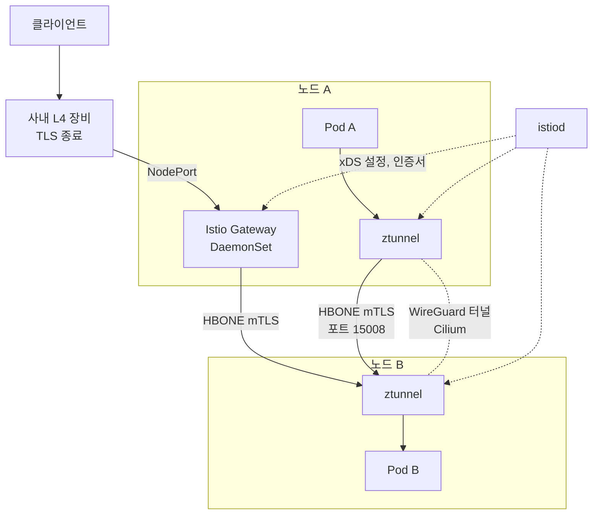

## 참고자료

- [Istio - Platform-Specific Prerequisites (Cilium)](https://istio.io/latest/docs/ambient/install/platform-prerequisites/)
- [Istio - HBONE](https://istio.io/latest/docs/ambient/architecture/hbone/)
- [Istio - PeerAuthentication](https://istio.io/latest/docs/reference/config/security/peer_authentication/)
- [Cilium - Integration with Istio](https://docs.cilium.io/en/stable/network/servicemesh/istio/)
- [Cilium - WireGuard Transparent Encryption](https://docs.cilium.io/en/stable/security/network/encryption-wireguard/)

---

## 배경

개발 클러스터는 그동안 Cilium과 Envoy Gateway 조합으로 운영했다. Cilium이 Pod 네트워킹과 네트워크 정책, 노드 사이 WireGuard 암호화를 맡고, Envoy Gateway가 클러스터 입구에서 라우팅과 인증을 맡았다. 서비스 메시는 쓰지 않기로 했었다. 워커 노드가 2대뿐이라 메시가 늘 먹는 자원과 운영 부담에 비해 얻는 것이 작다고 봤기 때문이다.

2026년 9월 말에 이 결정을 뒤집었다. Envoy Gateway를 걷어내고 Istio Gateway로 옮기면서 Istio Ambient 모드를 설치했고, 워크로드를 메시에 넣은 뒤 메시 전체를 mTLS STRICT로 바꿨다. 이 글은 그 전환 과정과 운영에서 부딪힌 문제를 정리한 것이다. Ambient 모드의 구조 자체는 [7편](/posts/istio-ambient-deep-dive/)에, Istio Gateway와 Gateway API의 관계는 [8편](/posts/istio-gateway-deep-dive/)에 정리했다.

정리하면서 확인하고 싶었던 것들이다.

- 노드 사이를 WireGuard로 이미 암호화하고 있는데 mTLS가 왜 또 필요한가?
- Cilium 위에 Istio Ambient를 올릴 때 무엇을 바꿔야 하는가?
- 운영 중인 게이트웨이를 Envoy Gateway에서 Istio Gateway로 어떻게 옮기는가?
- 워크로드를 메시에 넣을 때 기존 연결을 끊지 않으려면 어떻게 하는가?
- 전환 후 운영에서 어떤 문제가 생겼는가?

---

## 큰 그림

암호화가 두 겹이다. 노드와 노드 사이를 지나는 패킷은 Cilium이 WireGuard로 감싼다. 그 안에서 Pod와 Pod 사이 연결은 각 노드의 ztunnel이 mTLS로 다시 감싼다. 클러스터 입구의 Istio Gateway도 같은 istiod에서 설정을 받는다.

1절은 두 암호화가 각각 무엇을 보호하는지, 2절은 Cilium과 Ambient를 같이 쓰기 위한 설정, 3절은 게이트웨이 전환, 4절은 워크로드를 메시에 넣는 방법, 5절은 mTLS STRICT 전환, 6절은 운영에서 생긴 문제다.

---

## 1. WireGuard와 mTLS가 보호하는 것

### 1.1 WireGuard: 노드 사이 구간

WireGuard는 리눅스 커널에 들어 있는 경량 VPN 프로토콜이다. Cilium은 노드마다 WireGuard 키 쌍을 만들고, 공개 키를 CiliumNode 리소스에 올려 다른 노드와 교환한 뒤, 노드 사이에 터널을 만든다. 다른 노드에 있는 Pod로 가는 패킷은 이 터널을 지나며 암호화된다. 애플리케이션이나 Pod 설정은 바꿀 필요가 없다.

이 클러스터는 strict 모드로 켜 두었다. Pod 대역(CIDR)으로 가는 트래픽이 암호화되지 않은 채 나가려 하면 Cilium이 버린다. 키 교환이 늦거나 설정이 풀린 노드에서 평문이 새는 것을 막기 위해서다. WireGuard 헤더가 붙는 만큼 MTU를 1420으로 낮췄다(1500에서 헤더 80바이트를 뺀 값).

WireGuard가 보호하지 못하는 것이 두 가지 있다.

| 한계 | 내용 |
|---|---|
| 같은 노드 안의 트래픽 | Cilium 공식 문서에 명시된 제약이다. 같은 노드의 Pod끼리 주고받는 패킷은 노드 밖으로 나가지 않으므로 암호화되지 않는다 |
| 서비스 신원 | WireGuard는 "어느 노드에서 왔는가"만 보장한다. 요청을 보낸 것이 어느 서비스인지는 증명하지 않는다 |

### 1.2 mTLS: 서비스와 서비스 사이

mTLS는 클라이언트와 서버가 서로 인증서를 내서 신원을 확인하는 TLS다. Istio에서는 istiod가 각 워크로드의 ServiceAccount를 기준으로 인증서를 발급한다. 인증서에는 `spiffe://cluster.local/ns/<네임스페이스>/sa/<서비스어카운트>` 형태의 신원이 들어 있다. 그래서 받는 쪽은 "이 연결은 특정 네임스페이스의 특정 서비스가 보냈다"는 것을 인증서로 확인하고, AuthorizationPolicy로 그 신원에 따라 허용하거나 막을 수 있다.

Ambient 모드에서는 이 mTLS를 Pod 옆 사이드카가 아니라 노드마다 하나씩 뜨는 ztunnel이 처리한다. ztunnel끼리는 HBONE으로 통신한다. HBONE은 원래 TCP 연결을 HTTP/2 CONNECT 터널에 실어 mTLS로 보호하는 방식이고, 포트 15008을 쓴다. 같은 노드 안의 Pod끼리도 ztunnel을 거치므로 1.1의 첫 번째 한계가 메워진다.

### 1.3 두 겹을 유지한 이유

mTLS가 서비스 사이를 모두 암호화한다면 WireGuard는 빼도 되지 않느냐는 질문이 남는다. 둘을 유지한 이유는 보호 범위가 다르기 때문이다.

| 구분 | WireGuard (Cilium) | mTLS (Istio Ambient) |
|---|---|---|
| 계층 | L3, 노드 사이 패킷 | L4, 서비스 사이 연결 |
| 범위 | 메시 밖 워크로드와 시스템 Pod를 포함한 노드 간 Pod 트래픽 전체 | 메시에 들어온 워크로드끼리 |
| 같은 노드 | 암호화 안 됨 | 암호화됨 |
| 신원 | 노드 | 서비스(ServiceAccount) |
| 접근 제어에 쓰는가 | 아니오 | AuthorizationPolicy의 근거 |

메시 밖에 남는 것들(모니터링 수집기, 외부 장비에서 들어오는 평문 진입 등)도 노드 사이를 지날 때는 WireGuard가 계속 보호한다. 반대로 mTLS는 같은 노드 구간과 서비스 신원 확인을 맡는다.

---

## 2. Cilium 위에 Ambient를 올리기 위한 설정

Ambient 모드에서는 istio-cni라는 노드 에이전트가 Pod가 뜰 때 그 Pod의 트래픽을 ztunnel로 돌리는 규칙을 설치한다. istio-cni는 기존 CNI 뒤에 체인으로 붙는다. Cilium은 기본 설정으로 이것을 허용하지 않아서 아래 설정이 필요했다. Istio와 Cilium 공식 문서에 각각 명시된 요구 사항이다.

| 설정 | 이유 |
|---|---|
| `cni.exclusive=false` | Cilium은 기본적으로 노드의 다른 CNI 설정 파일을 치워 버린다. 그러면 istio-cni가 체인에서 빠져 트래픽이 ztunnel로 가지 않는다 |
| `socketLB.hostNamespaceOnly=true` | 이 클러스터는 Cilium이 kube-proxy를 대체한다. 이때 Cilium은 Pod 안의 소켓 단계에서 Service IP를 실제 Pod IP로 바꿔 버리는데, 그러면 Istio가 원래 목적지(Service)를 알 수 없다. 소켓 단계 변환을 호스트 네임스페이스로 제한한다 |
| BPF masquerade 끄기 | Cilium의 eBPF 기반 masquerade는 Istio가 kubelet 헬스 체크를 구분하는 link-local 주소와 충돌한다. Istio 공식 문서가 지원하지 않는다고 명시한다. 기본 iptables masquerade를 쓴다 |
| link-local 헬스 프로브 허용 | Ambient에서 kubelet의 헬스 프로브는 출발지가 169.254.7.127로 바뀌어 들어온다. 기본 차단 정책이 있으면 Cilium이 이 주소를 알아보지 못해 프로브를 막는다. CiliumClusterwideNetworkPolicy로 이 주소를 허용했다 |

L7 정책은 한쪽에서만 건다. Ambient 트래픽은 포트 15008의 mTLS 터널 안에 들어 있어서 Cilium은 L4 정보만 볼 수 있다. Cilium 문서도 두 쪽의 L7 정책을 동시에 쓰지 말라고 권한다. 그래서 L3, L4 통제는 Cilium 네트워크 정책이, 서비스 신원과 L7 통제는 Istio가 맡도록 나눴다.

같은 노드의 Pod끼리 통신하던 기존 네트워크 정책도 확인해야 했다. 메시에 들어간 Pod 사이 트래픽은 포트 15008(HBONE)로 바뀌기 때문이다. 이 클러스터의 정책은 같은 네임스페이스와 게이트웨이에서 오는 트래픽을 모든 포트로 허용하고 있어서 15008을 따로 열 필요가 없었다.

---

## 3. 게이트웨이 전환: Envoy Gateway에서 Istio Gateway로

### 3.1 바꾼 이유

처음 Envoy Gateway를 고른 이유 중 하나가 "Istio는 istiod 전체를 들여야 해서 무겁다"였다. Ambient를 도입하면서 이 전제가 사라졌다. istiod는 메시 때문에 어차피 돌고, Ambient는 사이드카가 없다. 그러면 게이트웨이도 같은 istiod에서 설정을 받는 편이 관리할 것이 줄어든다. Envoy Gateway 컨트롤러와 그 CRD 12종이 빠졌다.

### 3.2 배포 방식

외부 진입은 사내 L4 장비가 TLS를 끝내고 각 워커 노드의 NodePort로 넘기는 구조다. L4 장비는 노드마다 NodePort로 헬스 체크를 한다. 그래서 Gateway API가 자동으로 만드는 Deployment 대신 Istio의 `gateway` 차트를 DaemonSet으로 직접 배포해 모든 노드에 게이트웨이가 하나씩 뜨게 했다.

### 3.3 인증 이관

Envoy Gateway에서는 SecurityPolicy라는 확장 리소스 하나로 JWT, API Key, Basic 인증, 헤더 주입을 처리했다. Istio에는 같은 것이 없어서 나눠 옮겼다.

| 기능 | Envoy Gateway | Istio |
|---|---|---|
| JWT 서명 검증 | SecurityPolicy | RequestAuthentication |
| 토큰 없는 요청 차단, 경로별 허용 | SecurityPolicy | AuthorizationPolicy |
| API Key, Basic 인증, 자격 증명 주입 | SecurityPolicy | TrafficExtension(Lua 스크립트, Alpha 기능) |
| 외부 백엔드 TLS 연결 | Envoy Gateway 확장 리소스 | ServiceEntry + BackendTLSPolicy |
| 연결 유휴 시간 | Envoy Gateway 확장 리소스 | DestinationRule |

TrafficExtension은 아직 Alpha 기능이라 다음 Istio 버전에서 필드가 바뀔 수 있다. 이 리소스를 쓰는 파일 목록을 따로 기록해 두었다.

### 3.4 전환 절차와 실제 중단 시간

전환 기간에는 모든 HTTPRoute가 옛 Envoy Gateway와 새 Istio Gateway 양쪽에 붙어 있게 했다. 새 게이트웨이 DaemonSet이 Ready가 된 뒤에 NodePort를 새 게이트웨이로 넘기도록 ArgoCD 동기화 순서(sync wave)를 나눴다. kind에서 연습했을 때 끊김은 2~4초였다.

개발 클러스터에서는 93초 동안 끊겼다. 원인은 Finalizer였다. Finalizer는 오브젝트를 지울 때 담당 컨트롤러가 정리를 마칠 때까지 삭제를 멈춰 두는 표시다. ArgoCD ApplicationSet 템플릿에 걸려 있던 리소스 정리 Finalizer가 Envoy Gateway 컨트롤러까지 먼저 지워 버렸고, 그 컨트롤러가 처리해야 할 GatewayClass의 Finalizer가 풀리지 않아 정리가 멈췄다. 후속 PR에서 해당 Finalizer를 제거했다.

---

## 4. 워크로드를 메시에 넣는 방법

Ambient에서 워크로드를 메시에 넣는 가장 쉬운 방법은 네임스페이스에 `istio.io/dataplane-mode: ambient` 라벨을 붙이는 것이다. 사이드카처럼 Pod를 재시작할 필요가 없다.

이 방법을 쓰지 않았다. kind에서 시험해 보니 네임스페이스에 라벨을 붙이는 순간 그 네임스페이스 Pod들이 가지고 있던 기존 연결이 끊겼다. DB 커넥션 풀도 끊긴다. 커넥션 풀이 끊기면 애플리케이션이 재연결하는 동안 요청이 실패한다.

대신 Pod 템플릿에 같은 라벨을 넣었다. 그러면 롤링 업데이트로 새 Pod부터 하나씩 메시에 들어가고, 옛 Pod는 기존 연결을 유지한 채 내려간다. 워크로드 차트 11개, Pod 템플릿 17곳에 공통 값으로 라벨을 넣을 수 있게 했다.

이 방식에는 빈틈이 있다. 공통 값을 쓰지 않고 Pod 템플릿을 직접 쓴 차트는 라벨이 빠진 채 조용히 메시 밖에 뜬다. 이를 잡으려고 Kyverno 정책을 추가했다. 대상 네임스페이스의 Pod에 라벨이 없으면 정책 리포트에 실패로 남긴다. 차단(Enforce)이 아니라 기록(Audit)으로 걸었다. 정책 때문에 배포가 막히지 않으면서 누락을 찾을 수 있다.

먼저 넣은 네임스페이스는 네트워크 정책이 가장 좁은 곳이었다. 정책에서 15008 포트가 빠졌다면 바로 드러나기 때문이다.

---

## 5. mTLS STRICT 전환

워크로드를 메시에 넣는 것만으로는 mTLS가 강제되지 않는다. 기본 모드는 PERMISSIVE라서 mTLS와 평문을 모두 받는다. istio-system 네임스페이스(루트 네임스페이스)에 PeerAuthentication을 STRICT로 두면 메시 전체에 적용되어, 메시 안 Pod는 mTLS(HBONE) 연결만 받는다.

문제는 메시 밖에서 평문으로 들어와야 하는 연결이다. 메트릭을 긁어 가는 수집기, 외부 장비에서 평문으로 들어오는 진입, 메시 밖 DB 클라이언트가 있었다. 이 연결들은 STRICT를 켜는 순간 끊긴다. 그래서 해당 포트만 PERMISSIVE로 두는 예외를 먼저 넣고, 그다음 메시 전체 STRICT를 켰다. 순서를 반대로 하면 예외가 들어가기 전까지 그 경로들이 끊긴다.

Ambient에서는 PeerAuthentication의 DISABLE 모드를 쓸 수 없다. 트래픽이 ztunnel을 거치는 이상 HBONE 터널을 쓰기 때문이다. 예외는 PERMISSIVE로 둔다.

---

## 6. 운영에서 생긴 문제

### 6.1 메트릭 라벨 수 초과로 전부 거부

전환 직후 게이트웨이 메트릭(`istio_requests_total` 등)이 전부 저장소에서 거부됐다. Istio 메트릭은 출발지와 목적지 정보를 라벨로 많이 붙이는데, 여기에 Pod 라벨까지 합쳐져 시계열 하나의 라벨이 52개가 됐다. 메트릭 저장소 Mimir의 시계열당 라벨 한도(`max_label_names_per_series`)는 40이다.

게이트웨이 쪽은 Istio Telemetry 리소스의 `tagOverrides`로 쓰지 않는 라벨 14개를 지웠다. 게이트웨이가 출발지로 기록하는 라벨은 늘 게이트웨이 자신이라 의미가 없었다. 대신 알림을 경로별로 묶을 수 있게 route 이름을 라벨로 더했다. 결과는 36개다.

ztunnel 메트릭(`istio_tcp_*`)도 47개로 한도를 넘었다. ztunnel은 Telemetry의 `tagOverrides`를 받지 않아서, 메트릭을 중계하는 OpenTelemetry Collector에서 출발지와 목적지의 principal, cluster, version 등 10개 라벨을 버리도록 했다.

라벨을 줄인 뒤에도 한동안 거부가 이어졌다. 게이트웨이 Envoy가 이전에 만든 시계열을 메모리에 들고 계속 내보냈기 때문이다. 게이트웨이를 재시작해 옛 시계열을 비웠다.

### 6.2 인증 스크립트 오류가 요청을 통과시킴

Envoy의 Lua 필터는 스크립트에서 오류가 나면 오류 카운터만 올리고 요청을 다음 필터로 넘긴다. 인증 판단 스크립트가 오류를 내면 인증 없이 요청이 통과하는 구조였다. 판단 로직을 `pcall`로 감싸 오류가 나면 403으로 막고, route 이름이 비어 있는 요청도 403으로 막도록 바꿨다. 보안 장치는 오류가 났을 때 막는 쪽(fail-closed)으로 동작해야 한다.

### 6.3 ztunnel 재시작

ztunnel은 노드당 하나라서 재시작하면 그 노드의 메시 Pod 전체가 영향을 받는다. kind에서 ztunnel을 재시작하며 요청을 보냈을 때 새 요청 40건 중 2건이 실패했고, 이미 열린 연결은 유지됐다. ztunnel을 업그레이드할 때는 해당 노드를 먼저 drain해 Pod를 다른 노드로 옮긴 뒤 진행하도록 운영 절차에 넣었다. 노드가 2대뿐이라 한 노드의 장애 범위가 클러스터의 절반이라는 점은 Ambient를 처음 검토할 때부터의 우려였고, 지금도 남아 있는 위험이다.

### 6.4 CRD가 앱 삭제와 함께 지워질 위험

Istio CRD를 설치하는 ArgoCD 앱에 prune(Git에서 사라진 리소스를 클러스터에서도 지움)이 켜져 있으면, 앱을 지우거나 이름을 바꿀 때 CRD가 같이 지워진다. CRD가 지워지면 그 종류의 모든 리소스(모든 AuthorizationPolicy, PeerAuthentication 등)가 함께 사라진다. Istio CRD 앱과 Gateway API CRD 앱은 prune과 삭제 대상에서 빼 두었다.

---

## 정리하며

처음 던진 질문들에 대한 답이다.

- **WireGuard가 있는데 mTLS가 왜 필요한가?** WireGuard는 노드 사이 구간만 암호화하고 같은 노드 안의 트래픽은 암호화하지 않는다. 또 노드 신원만 보장할 뿐 어느 서비스가 보낸 요청인지는 증명하지 않는다. mTLS가 같은 노드 구간과 서비스 신원을 맡고, WireGuard는 메시 밖 트래픽을 포함한 노드 간 구간을 계속 보호한다.
- **Cilium 위에 Ambient를 올릴 때 무엇을 바꾸는가?** `cni.exclusive=false`, kube-proxy 대체 환경에서 `socketLB.hostNamespaceOnly=true`, BPF masquerade 끄기, link-local 헬스 프로브 주소 허용 네 가지다. L7 정책은 Istio 한쪽에서만 건다.
- **게이트웨이는 어떻게 옮기는가?** 같은 HTTPRoute를 두 게이트웨이에 동시에 붙여 두고, 새 게이트웨이가 준비된 뒤 NodePort를 넘긴다. 인증은 RequestAuthentication, AuthorizationPolicy, Lua 확장으로 나눠 옮긴다. 연습 환경에서 드러나지 않은 Finalizer 문제로 실제 중단 시간이 2~4초에서 93초로 늘었다.
- **기존 연결을 끊지 않고 메시에 넣으려면?** 네임스페이스 라벨 대신 Pod 템플릿 라벨로 롤링 편입하고, 라벨 누락은 Kyverno 정책으로 잡는다. STRICT는 평문 예외를 먼저 넣은 뒤 켠다.
- **운영에서 생긴 문제는?** Istio 메트릭의 라벨 수가 저장소 한도를 넘었고, Lua 인증 스크립트가 오류 때 요청을 통과시켰다. ztunnel 재시작의 영향 범위와 CRD 삭제 위험은 운영 절차와 ArgoCD 설정으로 막았다.

큰 그림으로 돌아가면, 이 전환으로 노드 사이(WireGuard), 서비스 사이(mTLS), 클러스터 입구(Istio Gateway)를 각각 맡는 계층이 정해졌다. 게이트웨이와 메시가 같은 istiod 하나로 설정되면서, 처음에 메시를 미뤘던 이유였던 운영 부담은 오히려 줄었다.
